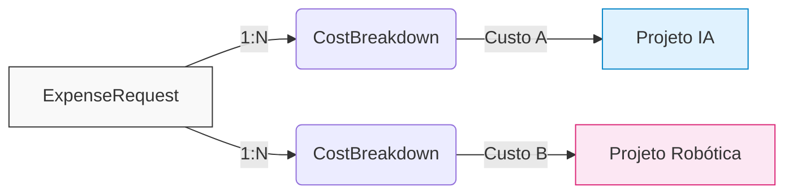

# Plano de Arquitetura: Discriminação Multi-Projeto e Integridade Temporal

## 1. O Novo Paradigma: 1:N (Discriminação de Custos)

O sistema evoluiu para suportar divisão de despesas. A Solicitação (`ExpenseRequest`) não é mais "dona" do projeto; os **Itens Discriminados** (`CostBreakdown`) assumiram esse papel.

> [!NOTE]  
> **Exemplo Prático (Baseado no fluxo de testes):** 
> Um aluno cria uma Solicitação de Despesa (`ExpenseRequest`) para uma "Viagem de Apresentação de Artigo" e anexa o seu **Memorando**. 
> Na fase de processamento, o Admin analisa o caso que totaliza R$ 300,00 e cria **duas Discriminações** (`CostBreakdowns`) para a mesma despesa (anexando os respectivos **comprovantes** em cada item):
> 1. Aloca R$ 100,00 na subcategoria *Passagem Aerea* do projeto IA.
> 2. Aloca R$ 200,00 na subcategoria *Inscrição* do projeto Robótica.

---

## 2. Maleabilidade da Discriminação de Custos

O maior risco sistêmico era o desconto antecipado de saldos de projetos, exigindo complexas rotinas de estorno em caso de cancelamento. Nós alteramos isso.

Ao apenas "comprometer" o valor dinamicamente, ganhamos margem livre para operação. Durante a fase `EM_PROCESSAMENTO`, o Admin pode **editar valores, remover itens ou reatribuir projetos** sem medo de corromper o banco de dados e sem a necessidade de programar rotinas de estorno/rollback. O `usedBudget` do Projeto só se move quando tudo é selado ao alterar a o status para `CONCLUIDO`

### 2.1 Fluxo Temporal do Dinheiro

A tabela abaixo define exatamente quando o dinheiro é tocado:

| Status da Despesa | Ação no Sistema | Impacto Físico (`Project.usedBudget`) | Impacto Analítico (Dashboard) |
| :--- | :--- | :--- | :--- |
| **`PENDENTE`** | Solicitação Criada | Nenhum | Nenhum |
| **`EM_PROCESSAMENTO`** | Admin cria o *CostBreakdown* | 🔒 Nenhum. O valor é apenas **Comprometido**. | Soma-se ao `usedBudget` para exibir ao Admin. |
| **`CONCLUIDO`** | Despesa Fechada | 💸 **Débito Executado.** Incrementa-se o saldo. | Já estava refletido. Continua igual. |
| **Cancelamentos** | Rejeição/Deleção | ✅ Nenhum rollback necessário. | O valor sai da soma dinâmica. |

---

## 3. Isolamento Ativo em Relatórios (Filtros)

Ao gerar relatórios e exportar PDFs, não podemos exibir o valor total da Solicitação de Despesa (ex: R$ 300,00) se o Admin filtrou os dados apenas pelo "Projeto IA" (que pagou apenas a **Inscrição** de R$ 100,00 daquela conta). O sistema precisa ocultar a parcela financeira do "Projeto Robótica" (que custeou a **Passagem Aérea** de R$ 200,00 restantes).

**Exemplo no Relatório PDF:**
Se exportarmos um PDF filtrando pelo "Projeto IA", a linha referente a essa despesa mostrará o valor de R$ 100,00 sob a discriminação de custo "Inscrição". O somatório total no final do documento também ignorará completamente a existência da "Passagem Aérea" (R$ 200,00) alocada no "Projeto Robótica".

---

## 4. O Impacto em Analytics e UX (Relatórios)

A quebra da relação 1:1 exigiu duas adaptações no motor de relatórios e apresentação.

### 4.1 O Ranking "Top Projects" (Furo Financeiro e Lixo Estatístico)

O Dashboard classifica os Projetos mais dispendiosos. A quebra da relação 1:1 e o fluxo de estados exigiram que abandonássemos funções agregadoras cegas do banco (como `_count` genérico e `orderBy` direto), pois elas geravam distorções críticas:

1. **Furo Financeiro (Ponto Cego):** Basear o ranking apenas no campo estático `usedBudget` ignorava o dinheiro atrelado a quebras de custos (`CostBreakdown`) de solicitações em andamento (`EM_PROCESSAMENTO`), disfarçando o esgotamento do limite real. A engine de Analytics agora calcula dinamicamente o valor comprometido somando `usedBudget` + montante retido `EM_PROCESSAMENTO`.
2. **Lixo Estatístico:** Contar o volume absoluto de `CostBreakdown` (para desempate) incluía despesas **REJEITADAS** e **CANCELADAS** mantidas para auditoria. Agora, a query aplica um filtro bloqueando alocações sujas e conta apenas o fluxo legal (agora explicitamente mapeado no contrato da API como `allocationsCount`).

### 4.2 O Layout "Inline" da Tabela de Gastos

Se uma despesa é fracionada, manter uma coluna genérica chamada "Projeto" no relatório PDF quebra a visualização. Nós **removemos** a coluna isolada de Projeto.

| Visualização Antiga ❌ | Visualização Atual (Inline) ✅ |
| :--- | :--- |
| Coluna 1: Categoria (`Hospedagem`)   Coluna 2: Projeto (`Robótica`) | Coluna Única: Composição   `Hospedagem (ROBOTICA-26)` |

A Engine PDF agora extrai e concatena essas informações na hora de desenhar a linha do relatório.

---

## 5. Vigência Temporal de Projetos (Project Period)

### 5.1 Barreira de Entrada (Allocation Block)
Nenhuma despesa pode ser faturada contra o orçamento de um projeto fora de seu período de vida. O `CostBreakdown` não será efetivado caso a data de tentativa de alocação não se encontre entre as balizas do projeto, disparando o erro arquitetural `PROJECT_PERIOD_EXPIRED`.

### 5.2 Proteção contra "Temporal Shrinkage" 
As edições do prazo do projeto foram separadas da edição de metadados padrão, recebendo uma rota própria (`PATCH /projects/:id/period`).

O maior risco mapeado seria um administrador encurtar a duração de um projeto (ex: fechá-lo em Junho, quando originalmente ia até Dezembro), deixando custos alocados nesses meses posteriores "órfãos" financeiramente. 

O sistema foi blindado para resolver esse caso:
- Ao notar qualquer tentativa de **encurtamento de prazo**, o serviço roda uma varredura rigorosamente tipada sobre a tabela filha `CostBreakdown`.
- Se for detectada *qualquer* alocação de custo nesse "hiato" de datas sendo removido, o sistema aborta a operação (status `409`) e reporta o exato número de órfãs na propriedade do erro `orphanedCostAllocationsCount` (`PROJECT_SHRINKAGE_CONFLICT`).
- Essa proteção contempla automaticamente pedidos ainda `EM_PROCESSAMENTO`, pois estes já possuem sua representação na tabela transacional de breakdowns. Nenhuma solicitação em andamento ficará descoberta.

